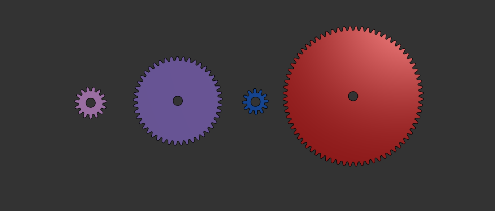
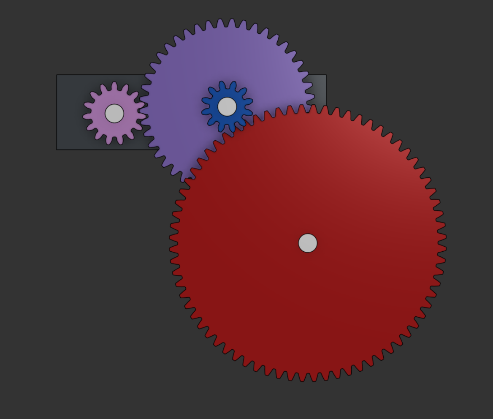

# Compound Gear Train – 18:1 Reduction

---

## Project Overview

This project demonstrates the design of a compound gear train system that achieves an 18:1 speed reduction.

The objective was to create a mechanical system in which the first gear rotates 18 times for the final output gear to complete one full rotation.

The system was modeled and assembled in Onshape to verify proper meshing, alignment, and motion transfer.

---

## Gear Teeth Configuration

- Gear 1 (Input Gear): 15 teeth  
- Gear 2: 45 teeth  
- Gear 3 (Compound with Gear 2): 12 teeth  
- Gear 4 (Output Gear): 72 teeth  

All gears share the same module and pressure angle to ensure correct meshing.

---

## System Explanation

The gear train consists of four spur gears arranged in two reduction stages:

- **Stage 1:** A small driver gear meshes with a larger gear (3:1 reduction).
- **Stage 2:** A smaller gear mounted on the same shaft as Gear 2 meshes with the final large output gear (6:1 reduction).

Since Gear 2 and Gear 3 share the same shaft, the total reduction becomes:

3 × 6 = 18

This means:

**18 rotations of the first gear produce 1 rotation of the final gear.**

---

### Compound Shaft Configuration

